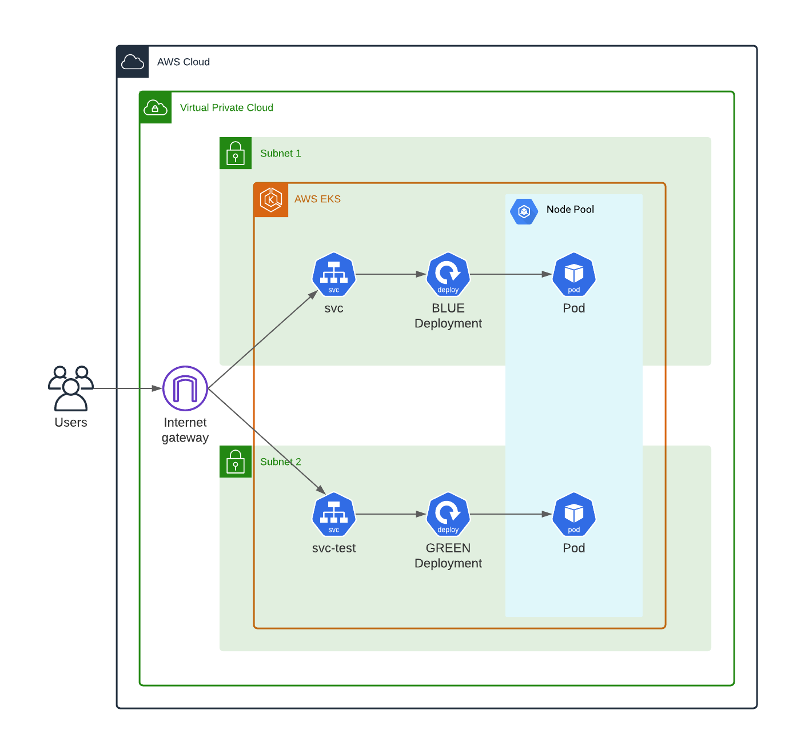

[](https://circleci.com/gh/jskline/udacity-final-project/tree/main)

# udacity-final-project
Final project submission for the Udacity AWS Cloud DevOps NanoDegree.

## Overview
This project uses CircleCI, AWS ECR, and Kubernetes to build, test, plubish, and deploy a dockerized Flask API to an AWS EKS Kubernetes cluster.

The EKS cluster and its infrastructure are initialized using cloudformation the aws-cli. The deployment is managed as a blue-green deployment, where traffic is transitioned to new deployments with no downtime using Kubernetes service LoadBalancers. A representative diagram of a deployment can be seen below:



### App
The application is a simple api built in python with Flask. It provides a simple status endpoint and swagger documentation. The project is setup with pytest for unittesting, flake8 for code style checking, and mypy for type checking. The application is packaged as a Docker image, which is also lint checked using hadolint.

## Initial Configuration nad CircleCI Setup
1. Create an AWS ECR repository for this project's docker images.
2. Add the following environment variables to your circleci project:
    ```
    AWS_ACCESS_KEY_ID
    AWS_DEFAULT_REGION
    AWS_SECRET_ACCESS_KEY
    ECR_ENDPOINT
    ```
3. Deploy the network infrastructure
    ```
    aws cloudformation deploy --stack-name simpleapi-eks-infra --region us-east-2 --template-file cloudformation/network-cf.yml --capabilities CAPABILITY_IAM
    ```
4. Create an EKS cluster. Use the outputs of the cloudformation cluster to fillout the `role-arn`, `subnetIds` and `securityGroupIds`
    ```
    aws eks --region us-east-2 create-cluster --name simpleapi-cluster --role-arn <arn-output> --resources-vpc-config subnetIds=<subnet-outputs>,securityGroupIds=<security-group>
    ```
5. Update your local kubeconfig so you can talk to the cluster with `kubectl`
    ```
    aws eks --region us-east-2 update-kubeconfig --name simpleapi-cluster
    ```
6. Deploy the EKS NodeGroup configuration. update the parameters file for your deployment.
    ```
    aws cloudformation deploy --stack-name simpleapi-eks-nodes --region us-east-2 --template-file cloudformation/nodes-cf.yml --capabilities CAPABILITY_IAM --parameter-overrides file://cloudformation/nodes-cf-params.json
    ```
7. Apply the node instance role from the output of the nodes cloudformation to  you kubernetes config map
    ```
    kubectl apply -f cloudformation/aws-auth-cm.yml
    ```
8. If desired, create an initial app deployment
    ```
    kubectl create -f k8s/simpleapi-deployment.yml
    kubectl create -f k8s/simpleapi-service.yml
    ```
## CI Pipeline
The CI Pipeline builds the python app, tests/lints the python app and dockerfile, builds/pushes a docker image to Amazon ECR, and executes a blue/green deployment.

### Things of note
* The Docker build stage is set up to manually cache docker layers (i think you have to pay to get the built-in caching)
* The Docker images are tagged with version strings generated from the first 7 characters in the GIT sha. this is used later to distinguish the kubernetes deployments and are used as a selector for the service/load balancer.
* The blue/green deployment stage uses a mix of aws-eks / kubernetes orb commands and manual kubectl calls.
* The green deployment is smoke-tested by hitting its API through a test kubernetes service/loadbalancer. if the smoke test fails, then the green deployment will be deleted.

## Development

    python3.8 -m venv venv
    . venv/bin/actiate
    pip install -r ./requirements.txt
    pip install -r ./requirements_dev.txt

Test / lint with  mypy, flake8, and pytest

    make all

Build docker image locally

    make docker

Run the Flask API locally

    make run
    make run-docker
